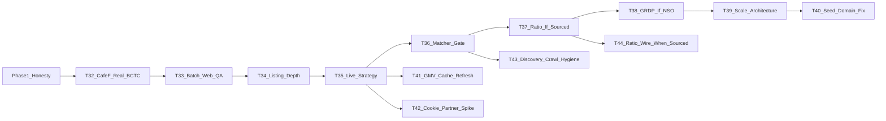

# Epic 3 Phase 2 — Data thật & scale path

**Ngày:** 2026-07-25  
**Sau:** Phase 1 handoff [`.scratch/handoff-epic3-phase1-data.md`](handoff-epic3-phase1-data.md) (Tasks #25–#31)  
**Ngoài phạm vi vẫn giữ:** M7–M9, redesign FE lớn, Prefect full, invent số.

Phase 1 = honesty + plumbing. Phase 2 = **số thật nơi lấy được**, QA hàng loạt, chiến lược live marketplace, và **kiến trúc scale** Section C — không nhồi seed demo lên trăm dòng.

---

## Task #32 — CafeF live → BCTC thật trên mẫu 28

**Status:** DONE (2026-07-25) — live smoke **28/28 `cafef_ok`**; persist quarterly + `source_url` CafeF; employees null giữ nguyên.

**Trả lời thắc mắc:** seed annual là demo; số thật lấy bằng đường CafeF đã có trong code, chạy **mạng thật**, ghi DB.

**Việc chính:**
- Smoke `fetch_bctc` / `fetch_cafef_bctc` full allowlist; bảng `ticker → status/detail/period/source_url`.
- Enrich upsert `financial_reports`; thiếu field = null (không backfill seed).
- Ops: `scripts/` hoặc pipeline companies batch + dòng trong `docs/ops-demo.md`.
- Optional sau: thiết kế HOSE/PDF/XBRL annual (chỉ spike nếu CafeF không đủ) — không bắt buộc đóng #32.

**AC:** ≥ phần lớn ticker có `cafef_ok` **hoặc** failure có detail rõ + vẫn fallback có nhãn; UI/API đọc được `source_url` CafeF khi ok; tests mock + không invent.

**Artifact:** `.scratch/epic3-task32-cafef-bctc-report.{md,csv}` · lệnh `PYTHONPATH=. python scripts/enrich_bctc_cafef.py`

---

## Task #33 — Batch website detector + audit marketplace URL

**Status:** DONE (2026-07-25) — batch audit script + report; seed flag→URL = 0 mismatch; DB DQC Shopee synced via `--fix-db`; seed re-seed upserts all DP channels.

**Trả lời thắc mắc:** chỗ check URL; provenance sai; biết DN nào lỗi khi không HTTP.

**Việc chính:**
- Một job/script: mọi ticker trong seed → website detector + liệt kê marketplace DP URLs.
- Báo cáo CSV/MD: `stock_code, website_ok, has_checkout, shopee_url, tiktok_url, flag_vs_url_mismatch`.
- Sửa seed/DB khi mismatch; không đoán checkout khi 403/timeout.
- Doc: “chỗ xem URL” = seed + report artifact + Company detail.

**AC:** chạy một lần trên 28 ra report; 0 flag marketplace=true thiếu URL; tests consistency giữ.

**Artifact:** `.scratch/epic3-task33-website-url-audit.{md,csv}` · lệnh `PYTHONPATH=. python scripts/audit_website_marketplace.py`

---

## Task #34 — Listing depth (không bịa GMV)

**Status:** DONE (2026-07-25) — DQC curated website catalog (price, units null); live smoke script + report; docs mẫu niêm yết vs TMĐT; B2B giữ `[]`.

**Trả lời thắc mắc:** vì sao ~5 brand; 10 DN ≠ 10 có listing.

**Việc chính:**
- Chỉ mở rộng listing khi: (a) live scrape `source=live` cho allowlist shop, hoặc (b) curation tay có PROVENANCE.
- DQC và peer có shop: ưu tiên live/curated; B2B giữ `[]`.
- Tách rõ trong docs: mẫu niêm yết vs mẫu có TMĐT.

**AC:** tăng số ticker có listing **chỉ** kèm provenance; digital_metrics không nhảy số không nguồn.

**Artifact:** `.scratch/epic3-task34-listing-depth.{md,csv}` · lệnh `PYTHONPATH=. python scripts/enrich_marketplace_listings.py`

---

## Task #35 — Chiến lược marketplace live (sau Playwright mock)

**Status:** DONE (2026-07-26) — ADR-0002: default allowlist+cache+badge; optional session cookie ops-only; reject anti-bot SaaS; partner API spike-only.

**Trả lời thắc mắc:** captcha/anti-bot; đề xuất xử lý.

**Bằng chứng từ #34:** smoke `scripts/enrich_marketplace_listings.py` — Shopee/TikTok allowlist shops đều HTTP **403**; `live_ok=0`. DQC có catalog website (price) nhưng chưa có `units_sold_est` từ sàn.

**Việc chính (chọn 1–2, ghi ADR ngắn nếu đụng ToS/chi phí):**
1. Allowlist nhỏ + cache snapshot + badge live|seed|fallback (mặc định khuyến nghị).  
2. Optional: session cookie sau login tay (ops only).  
3. Optional spike: API/đối tác dữ liệu — không implement full nếu không có hợp đồng.  
4. Không dùng anti-bot SaaS lách ToS làm mặc định đồ án.

**AC:** document quyết định trong `.scratch/` hoặc `docs/adr/`; crawl contract không silent invent; ít nhất một đường demo ổn định (cache hoặc live thật).

**Artifact:** `docs/adr/0002-marketplace-live-strategy.md` · `data/raw/marketplace_live_cache/` · `.scratch/epic3-task35-marketplace-live-strategy.md`

---

## Task #36 — Matcher: chỉ DN có shop; discovery có cổng

**Status:** DONE (2026-07-26) — discovery OFF by default; enable via `MARKETPLACE_DISCOVERY_ENABLED` + QA allowlist + threshold 0.65; train() không ép website alias cho no-shop tickers.

**Trả lời thắc mắc:** phần “chưa” #29.

**Việc chính:**
- Khi #33/#34 thêm URL → cập nhật alias/tests.
- Discovery search sàn: **tắt mặc định**; bật chỉ với threshold 0.65 + QA list.
- Không alias ép 28 ticker không shop.

**AC:** precision không tụt; ticker không shop vẫn unlinked.

**Artifact:** `data/mappings/discovery_allowlist.json` · gate trong `crawlers/marketplace/shop_finder.py`

---

## Task #37 — Industry-ratio (re-gate)

**Status:** DONE (2026-07-26) — **NO-GO**: vẫn `SOURCED_INDUSTRY_ECOMMERCE_RATIO=None`; research note re-gate; tests khóa None + no silent invent.

**Trả lời thắc mắc:** phần chưa #30.

**Việc chính:** chỉ wire nếu có tỷ trọng TMĐT/doanh thu (hoặc proxy được citation rõ) cho CBCT/manufacturing. File `data/mappings/` + PROVENANCE. Không dùng % kinh tế số/GDP làm × revenue DN.

**AC:** constant set **có citation** hoặc task đóng lại với “vẫn None” + cập nhật research note.

**Artifact:** `.scratch/epic3-task30-industry-ratio-research.md` § Task #37 re-gate

---

## Task #38 — GRDP/VA (re-gate NSO)

**Status:** DONE (2026-07-26) — **GO** national manufacturing VA from `GDPVNM.xml` (`VA_C` / `VA_C_NOMINAL`); province GRDP still deferred.

**Trả lời thắc mắc:** phần chưa #31.

**Việc chính:** xác nhận table PX-Web/SDMX; implement crawl chỉ khi có ID+series; không thì giữ deferred + IIP stack.

**AC:** series thật trong `gso_macro` có `source=GSO|GSO_FALLBACK` hoặc biên bản “chưa có bảng”.

**Artifact:** `.scratch/epic3-task31-grdp-spike.md` § Task #38 · `crawlers/gso/iip_crawler.py` (`fetch_gso_va`) · `data/raw/gso_va_fallback.csv`
---

## Task #47 — GRDP tỉnh×ngành re-gate (nợ từ #38)

**Status:** DONE (2026-07-28) — **NO-GO / deferred** biên bản only; no crawl; national `VA_C` remains GO.

**Trả lời thắc mắc:** còn thiếu GRDP tỉnh×ngành sau #38?

**Việc chính:** xác nhận lại citation gap (chưa table ID NSO tỉnh×ngành CBCT); ghi biên bản; **không** implement crawler; **cấm** copy `VA_C` quốc gia xuống tỉnh.

**AC:** biên bản deferred/NO-GO + evidence gap; plan `#47` `[x]`; crawl vẫn nằm «Chưa làm được…».

**Artifact:** `.scratch/epic3-task47-grdp-deferred.md` · `.scratch/epic3-task47-grdp-deferred.csv` · pointer trong `.scratch/epic3-task31-grdp-spike.md`

---

## Task #39 — Scale architecture (toàn Section C)

**Status:** DONE (2026-07-26) — docs + ADR-0003 + empty universe stub; no nationwide crawl.

**Trả lời thắc mắc:** sau này tìm tất cả DN CBCT thì scale thế nào.

**Việc chính (thiết kế + skeleton, không crawl cả nước):**
- Tách: **vũ trụ DN** (đăng ký / thống kê / niêm yết) vs **mẫu sâu** (BCTC+digital) vs **macro ngành**.
- Đặc tả ingest nông (VSIC, tên, website?) + queue lô + rate limit + provenance.
- Percentile/Digital VA trên mẫu niêm yết = prototype — không tuyên bố chuẩn quốc gia.
- Doc trong `docs/economy-knowledge.md` + ADR-0003.
- Stub: `data/raw/company_universe/rows.json` = `[]` + `backend/app/schemas/universe.py` (không migration DB — identity key chưa chốt).

**Giới hạn (ghi rõ):** không invent hàng trăm BCTC/GMV; không scale bằng copy seed; không chọn registry provider khi chưa verify access; #40–#43 ngoài phạm vi.

**AC:** tài liệu + optional schema/stub “universe” (không invent hàng trăm BCTC); plan ghi rõ giới hạn. ✅

**Artifact:** `docs/adr/0003-scale-section-c-architecture.md` · `docs/economy-knowledge.md` §6.0 · `data/raw/company_universe/` · `tests/universe/test_universe_stub.py`

---

## Task #40 — Sửa domain website seed (nợ kỹ thuật từ audit #33)

**Status:** DONE (2026-07-27) — `website_ok` 19→**27/28**; chỉ GEE còn SSL fail + checkout `unknown`. Biên bản: [`.scratch/epic3-task40-website-domain-fix.md`](epic3-task40-website-domain-fix.md).

**Nguồn:** audit Task #33 chạy live 2026-07-25 — `website_ok=19/28`. 9 ticker còn lại **chưa đo được** (không phải “không có TMĐT”).

| Ticker | Seed sau #40 | Kết luận |
|--------|--------------|----------|
| IDI | `https://idiseafood.com` | OK 200 |
| SBT | `https://ttcagris.com.vn` | OK 200 |
| NKG | `https://tonnamkim.com` | OK 200 |
| POM | `http://www.pomina-steel.com` | OK 200 (HTTPS weak key — dùng HTTP) |
| TLH | `https://www.tienlengroup.vn` | OK 200 |
| GEE | `https://gelex-electric.com` | **FAIL** SSL issuer — giữ URL + checkout unknown |
| DPR | `https://doruco.com.vn` | OK 200 |
| CSV | `https://sochemvn.com` | OK 200 |
| DCM | `https://www.pvcfc.com.vn` | OK 200 |

**AC:** ✅ mỗi ticker có kết luận URL mới OK hoặc biên bản fail; không suy checkout khi chưa fetch; không tắt SSL verify.

**Artifact:** `.scratch/epic3-task40-website-domain-fix.md` · audit refresh `.scratch/epic3-task33-website-url-audit.{md,csv}`

---

## Task #41 — GMV backfill + refresh live-cache (nợ từ #34/#35)

**Nguồn:** Task #34 đóng với listing tickers 5→6 nhưng **GMV tickers vẫn 5**. DQC có listing catalog (`platform=website`, price set, `units_sold_est=null`). Live Shopee/TikTok 403. VNM/PNJ có TikTok shop URL nhưng chưa có TikTok listing rows.

**Nợ thêm từ #35:** snapshot `data/raw/marketplace_live_cache/` hiện là **demo-shaped** (cùng parse shape fixture) — chưa phải bản ghi “scrape thật ngày X”. HTTP live vẫn 403; badge `live` từ cache chưa = “fetch mạng thành công lần này”.

**Phụ thuộc:** sau Task #35 (đã có đường allowlist+cache ổn định). Không invent units.

**Việc chính:**
- Khi live/cache trả về items có `historical_sold` / sold: upsert DQC (và shop peers) với `source=live` (hoặc cache-tagged live), điền `units_sold_est` + `revenue_est = price × units`.
- **Refresh cache:** nếu có parse live thật (hoặc session cookie ops #42) → ghi đè `RAL.shopee.json` / `VNM.tiktok.json` (và peers allowlist) + cập nhật `PROVENANCE.md` (ngày capture, URL).
- Optional: TikTok listing depth cho VNM/PNJ nếu scrape/cache được.
- Re-run `scripts/enrich_marketplace_listings.py`; so `with_gmv_listing` trước/sau trong `.scratch/`.
- Peer B2B không shop vẫn `[]`.

**AC:** DQC (hoặc ticker mục tiêu) có ≥1 listing GMV có provenance; online_revenue chỉ tăng đúng Σ listing có nguồn; không pad B2B; cache PROVENANCE phản ánh capture thật nếu đã refresh.

**Không làm:** bịa units để “đủ 10 DN GMV”; đổi Digital VA; anti-bot SaaS.

---

## Task #42 — Session cookie ops smoke + partner API spike note (nợ từ #35)

**Status:** DONE (2026-07-27) — cookie `present=yes`; live HTTP vẫn anti-bot/403 (`live_ok=0` `--no-cache`); cache-on-fail `live_ok=2`; partner spike = no implement without contract; anti-bot SaaS rejected.

**Nguồn:** ADR-0002 Decision §2–§3 — cookie env đã wire (`SHOPEE_SESSION_COOKIE` / `TIKTOK_SESSION_COOKIE`); #42 chứng minh smoke tay + biên bản.

**Việc chính:**
- Ops: login tay → set cookie env → chạy smoke 1–2 shop allowlist; ghi kết quả 403 vs ok vào `.scratch/` (không commit secret).
- Nếu cookie hết hạn / vẫn 403 → ghi nhận; giữ cache/seed path.
- Spike note ngắn: có API/đối tác dữ liệu TMĐT VN phù hợp đồ án không (chi phí/ToS) — **không implement full** nếu không có hợp đồng.
- Không dùng anti-bot SaaS làm mặc định.

**AC:** artifact smoke cookie (pass/fail + detail) + optional partner spike note trong `.scratch/`; secrets không vào git.

**Artifact:** `.scratch/epic3-task42-cookie-ops-smoke.md` · `.scratch/epic3-task42-partner-api-spike.md`

**Không làm:** commit cookie; đổi Digital VA; implement ingest partner full; refresh live-cache (#41 — tạm dừng).

---

## Task #43 — Discovery crawl thật + fuzzy hygiene (nợ từ #36)

**Nguồn:** Task #36 đóng cổng discovery (OFF mặc định + QA allowlist + 0.65) nhưng **chưa** có crawler tìm shop trên sàn; matcher vẫn có vài quirks fuzzy.

**Trả lời thắc mắc:** “bật discovery thì tìm shop ở đâu?”; “vì sao DPR có thể gần `rangdong`?”

**Việc chính:**
1. **Discovery source thật (khi ToS/ops cho phép):** crawler/search Shopee/TikTok theo brand → candidate URL → chỉ feed vào `discover_shops_for_company` (vẫn cần flag + allowlist hoặc promote vào allowlist sau QA). Không invent URL.
2. **Ops smoke cổng:** thêm ≥1 entry QA thật vào `discovery_allowlist.json` (ticker đã có shop đã biết, ví dụ RAL) → bật env → chứng minh `match_source=qa_discovery`; rồi có thể để lại empty nếu chỉ demo gate.
3. **Fuzzy hygiene (optional nhưng nên làm):**
   - Token ngắn generic (`dong`, …) dễ FP giữa DN cao su / đèn — siết rule token ≥N hoặc noise list có citation test.
   - Cân nhắc: `_BRAND_MARKERS` no-shop peers chỉ dùng khi ticker nằm allowlist (score-only hôm nay vẫn OK vì gate chặn link).
   - `resolve_shop_to_company` (pipeline clean) nếu nhận discovery rows → tôn trọng cùng gate/allowlist, không bypass.
4. **ML nâng cấp (đã ghi plan cũ):** TF-IDF / classifier đầy đủ chỉ khi fuzzy + gate không đủ precision trên mẫu lớn hơn.

**AC:** có đường candidate shop từ search **hoặc** biên bản “vẫn chưa crawl search (anti-bot/ToS)”; cổng #36 không bị phá; precision baseline không tụt; không invent shop/GMV. ✅

**Không làm trong #43:** đổi Digital VA; bật discovery mặc định; anti-bot SaaS; ép alias 22 ticker không shop.

**Artifact:** `.scratch/epic3-task43-discovery-crawl.{md,csv}` · `docs/ops-demo.md` · search path in `shop_finder.py` · fuzzy hygiene in `matcher.py`

---

## Task #44 — Industry-ratio wire (khi có citation CBCT) — nợ từ #37

**Nguồn:** Task #37 đóng **NO-GO** — không có tỷ trọng TMĐT/doanh thu chế biến chế tạo (VSIC C) có citation đủ. Code giữ `SOURCED_INDUSTRY_ECOMMERCE_RATIO = None`; thiếu listing → `online_revenue = 0` + log.

**Trả lời thắc mắc:** “bao giờ DN không có listing mới có online_revenue ước từ ngành?”

**Điều kiện mở task (bắt buộc có ≥1):**
- GSO/NSO: module DN ICT/TMĐT theo VSIC, hoặc
- MoIT white paper: breakout online/total revenue cho CBCT, hoặc
- VECOM: bảng **chỉ manufacturing** mean/median online÷doanh thu (không dùng Fig. 20 all-sector bins), hoặc
- UNCTAD/NSO: VN có business e-commerce sales by industry

**Việc chính (khi GO):**
1. File `data/mappings/` (vd. `manufacturing_ecommerce_ratio.json`) + `*.PROVENANCE.md` (năm, table/figure ID, URL).
2. Set `SOURCED_INDUSTRY_ECOMMERCE_RATIO` (load từ mapping, không hard-code im lặng).
3. Cập nhật tests: HPG/no-listing có thể nhận `ratio × BCTC` **chỉ** khi constant wired; giữ guard chống GDP digital % / bin VECOM.
4. Docs: `CONTEXT.md`, `docs/knowledge.md`, `docs/ops-demo.md`; ADR ngắn nếu đụng Digital VA path.

**AC:** constant >0 có citation trong mappings + PROVENANCE; missing listings dùng ratio có nguồn; không dùng % KT số/GDP hay invent 0.15.

**Không làm:** bịa số trước khi có bảng; dùng digital VA % GDP; dùng VECOM all-sector bins.

**Artifact:** cập nhật `.scratch/epic3-task30-industry-ratio-research.md` § GO + mapping file.

---

## Definition of Done Phase 2

- Cho phép demo/ops: BCTC trên mẫu 28 **ưu tiên số CafeF/live** khi mạng cho phép; seed chỉ fallback có nhãn.
- Có artifact audit URL/checkout cả mẫu.
- Marketplace: chiến lược live đã chọn + listing chỉ tăng khi có nguồn.
- Ratio/GRDP: wired có nguồn hoặc deferred có biên bản mới.
- Có blueprint scale Section C (không scale bằng copy seed).
- `docs/plan.md` Epic 3 Phase 2 checklist cập nhật khi đóng từng task; handoff `.scratch/handoff-epic3-phase2-*.md`.

**Close audit (2026-07-28):** DoD **đạt** (ratio/GRDP theo đường deferred; live marketplace honest-blocked). Handoff: [`.scratch/handoff-epic3-phase2.md`](handoff-epic3-phase2.md). Runnable `#40` `#42` `#43` `#45` `#46` `#47` `#50` (+ `#51`) DONE. Paused `#41` `#48` `#49` `#19b`. Không invent Epic 3 Phase 3.

**Thứ tự chat (cân bằng micro ↔ macro sau #39):** `#40` → **`#45` ✓** → **`#46` ✓** → **`#43` ✓** → **`#47` ✓** → **`#50` ✓** → **phase-close** (không làm cả chuỗi trong một chat; `#41`/`#48`/`#49`/`#19b` tạm dừng).

**Nợ kỹ thuật đã ghi:**
- Task #40 ✓ (website domain fix — 27/28 OK; GEE SSL còn fail có biên bản).
- Task #41 (GMV backfill DQC + refresh live-cache từ capture thật; optional TikTok) — từ #34/#35 — **tạm dừng có chủ đích** (2026-07-27).
- Task #42 ✓ (session cookie ops smoke + partner API spike note) — cookie present nhưng live HTTP vẫn block; cache path giữ.
- **Task #43 ✓ (discovery crawl thật + fuzzy hygiene)** — search path + deferred anti-bot biên bản; token FP `dong`⊂`rangdong` siết; cổng #36 giữ OFF mặc định.
- **Task #44 (industry-ratio wire khi có nguồn CBCT)** — từ #37 NO-GO; **không còn task roadmap** (chưa citation) per quyết định 2026-07-27.
- **Task #47 ✓ (GRDP tỉnh×ngành re-gate)** — NO-GO/deferred biên bản; crawl vẫn parked; cấm copy `VA_C` → tỉnh.
- **Task #50 ✓ (`UniverseCoverageNote` API + FE)** — `GET /api/universe/coverage` + SampleHonestyBanner; stub `rows=[]` → `prototype_listed_sample`; không invent universe.
