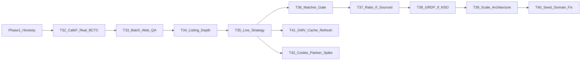

# Epic 3 Phase 2 — Data thật & scale path

**Ngày:** 2026-07-25  
**Sau:** Phase 1 handoff [`.scratch/handoff-epic3-phase1-data.md`](handoff-epic3-phase1-data.md) (Tasks #25–#31)  
**Ngoài phạm vi vẫn giữ:** M7–M9, redesign FE lớn, Prefect full, invent số.

Phase 1 = honesty + plumbing. Phase 2 = **số thật nơi lấy được**, QA hàng loạt, chiến lược live marketplace, và **kiến trúc scale** Section C — không nhồi seed demo lên trăm dòng.

---

## Task #32 — CafeF live → BCTC thật trên mẫu 28

**Status:** DONE (2026-07-25) — live smoke **28/28 `cafef_ok`**; persist quarterly + `source_url` CafeF; employees null giữ nguyên.

**Trả lời thắc mắc:** seed annual là demo; số thật lấy bằng đường CafeF đã có trong code, chạy **mạng thật**, ghi DB.

**Việc chính:**
- Smoke `fetch_bctc` / `fetch_cafef_bctc` full allowlist; bảng `ticker → status/detail/period/source_url`.
- Enrich upsert `financial_reports`; thiếu field = null (không backfill seed).
- Ops: `scripts/` hoặc pipeline companies batch + dòng trong `docs/ops-demo.md`.
- Optional sau: thiết kế HOSE/PDF/XBRL annual (chỉ spike nếu CafeF không đủ) — không bắt buộc đóng #32.

**AC:** ≥ phần lớn ticker có `cafef_ok` **hoặc** failure có detail rõ + vẫn fallback có nhãn; UI/API đọc được `source_url` CafeF khi ok; tests mock + không invent.

**Artifact:** `.scratch/epic3-task32-cafef-bctc-report.{md,csv}` · lệnh `PYTHONPATH=. python scripts/enrich_bctc_cafef.py`

---

## Task #33 — Batch website detector + audit marketplace URL

**Status:** DONE (2026-07-25) — batch audit script + report; seed flag→URL = 0 mismatch; DB DQC Shopee synced via `--fix-db`; seed re-seed upserts all DP channels.

**Trả lời thắc mắc:** chỗ check URL; provenance sai; biết DN nào lỗi khi không HTTP.

**Việc chính:**
- Một job/script: mọi ticker trong seed → website detector + liệt kê marketplace DP URLs.
- Báo cáo CSV/MD: `stock_code, website_ok, has_checkout, shopee_url, tiktok_url, flag_vs_url_mismatch`.
- Sửa seed/DB khi mismatch; không đoán checkout khi 403/timeout.
- Doc: “chỗ xem URL” = seed + report artifact + Company detail.

**AC:** chạy một lần trên 28 ra report; 0 flag marketplace=true thiếu URL; tests consistency giữ.

**Artifact:** `.scratch/epic3-task33-website-url-audit.{md,csv}` · lệnh `PYTHONPATH=. python scripts/audit_website_marketplace.py`

---

## Task #34 — Listing depth (không bịa GMV)

**Status:** DONE (2026-07-25) — DQC curated website catalog (price, units null); live smoke script + report; docs mẫu niêm yết vs TMĐT; B2B giữ `[]`.

**Trả lời thắc mắc:** vì sao ~5 brand; 10 DN ≠ 10 có listing.

**Việc chính:**
- Chỉ mở rộng listing khi: (a) live scrape `source=live` cho allowlist shop, hoặc (b) curation tay có PROVENANCE.
- DQC và peer có shop: ưu tiên live/curated; B2B giữ `[]`.
- Tách rõ trong docs: mẫu niêm yết vs mẫu có TMĐT.

**AC:** tăng số ticker có listing **chỉ** kèm provenance; digital_metrics không nhảy số không nguồn.

**Artifact:** `.scratch/epic3-task34-listing-depth.{md,csv}` · lệnh `PYTHONPATH=. python scripts/enrich_marketplace_listings.py`

---

## Task #35 — Chiến lược marketplace live (sau Playwright mock)

**Status:** DONE (2026-07-26) — ADR-0002: default allowlist+cache+badge; optional session cookie ops-only; reject anti-bot SaaS; partner API spike-only.

**Trả lời thắc mắc:** captcha/anti-bot; đề xuất xử lý.

**Bằng chứng từ #34:** smoke `scripts/enrich_marketplace_listings.py` — Shopee/TikTok allowlist shops đều HTTP **403**; `live_ok=0`. DQC có catalog website (price) nhưng chưa có `units_sold_est` từ sàn.

**Việc chính (chọn 1–2, ghi ADR ngắn nếu đụng ToS/chi phí):**
1. Allowlist nhỏ + cache snapshot + badge live|seed|fallback (mặc định khuyến nghị).  
2. Optional: session cookie sau login tay (ops only).  
3. Optional spike: API/đối tác dữ liệu — không implement full nếu không có hợp đồng.  
4. Không dùng anti-bot SaaS lách ToS làm mặc định đồ án.

**AC:** document quyết định trong `.scratch/` hoặc `docs/adr/`; crawl contract không silent invent; ít nhất một đường demo ổn định (cache hoặc live thật).

**Artifact:** `docs/adr/0002-marketplace-live-strategy.md` · `data/raw/marketplace_live_cache/` · `.scratch/epic3-task35-marketplace-live-strategy.md`

---

## Task #36 — Matcher: chỉ DN có shop; discovery có cổng

**Trả lời thắc mắc:** phần “chưa” #29.

**Việc chính:**
- Khi #33/#34 thêm URL → cập nhật alias/tests.
- Discovery search sàn: **tắt mặc định**; bật chỉ với threshold 0.65 + QA list.
- Không alias ép 28 ticker không shop.

**AC:** precision không tụt; ticker không shop vẫn unlinked.

---

## Task #37 — Industry-ratio (re-gate)

**Trả lời thắc mắc:** phần chưa #30.

**Việc chính:** chỉ wire nếu có tỷ trọng TMĐT/doanh thu (hoặc proxy được citation rõ) cho CBCT/manufacturing. File `data/mappings/` + PROVENANCE. Không dùng % kinh tế số/GDP làm × revenue DN.

**AC:** constant set **có citation** hoặc task đóng lại với “vẫn None” + cập nhật research note.

---

## Task #38 — GRDP/VA (re-gate NSO)

**Trả lời thắc mắc:** phần chưa #31.

**Việc chính:** xác nhận table PX-Web/SDMX; implement crawl chỉ khi có ID+series; không thì giữ deferred + IIP stack.

**AC:** series thật trong `gso_macro` có `source=GSO|GSO_FALLBACK` hoặc biên bản “chưa có bảng”.

---

## Task #39 — Scale architecture (toàn Section C)

**Trả lời thắc mắc:** sau này tìm tất cả DN CBCT thì scale thế nào.

**Việc chính (thiết kế + skeleton, không crawl cả nước):**
- Tách: **vũ trụ DN** (đăng ký / thống kê / niêm yết) vs **mẫu sâu** (BCTC+digital) vs **macro ngành**.
- Đặc tả ingest nông (VSIC, tên, website?) + queue lô + rate limit + provenance.
- Percentile/Digital VA trên mẫu niêm yết = prototype — không tuyên bố chuẩn quốc gia.
- Doc trong `docs/economy-knowledge.md` + ADR ngắn nếu cần.

**AC:** tài liệu + optional schema/stub “universe” (không invent hàng trăm BCTC); plan ghi rõ giới hạn.

---

## Task #40 — Sửa domain website seed (nợ kỹ thuật từ audit #33)

**Nguồn:** audit Task #33 chạy live 2026-07-25 — `website_ok=19/28`. 9 ticker còn lại **chưa đo được** (không phải “không có TMĐT”). Bằng chứng: [`.scratch/epic3-task33-website-url-audit.md`](epic3-task33-website-url-audit.md).

| Ticker | URL seed hiện tại | Lỗi |
|--------|-------------------|-----|
| IDI | `https://idi.com.vn` | DNS không phân giải |
| SBT | `https://ttcsugar.com.vn` | DNS không phân giải |
| NKG | `https://namkimgroup.vn` | ConnectTimeout |
| POM | `https://pomina-steel.com` | SSL: EE certificate key too weak |
| TLH | `https://tienlensteel.com.vn` | SSL: unable to get local issuer certificate |
| GEE | `https://gelexelectric.com.vn` | SSL: self-signed certificate |
| DPR | `https://dpr.com.vn` | SSL: self-signed certificate |
| CSV | `https://hcb.com.vn` | SSL: hostname mismatch |
| DCM | `https://damcamau.vn` | Connection reset by peer |

**Việc chính:**
- Xác minh tay domain/URL công bố (công bố thông tin HOSE/HNX, CafeF profile) → cập nhật `data/seeds/companies.json` (`website_url` + `digital_presence.website.url`).
- Với site SSL yếu/self-signed: quyết định rõ ràng — đổi URL đúng, hoặc ghi nhận “không fetch được” như trạng thái hợp lệ. **Không** tắt verify SSL toàn cục để lấy số.
- Chạy lại `PYTHONPATH=. python scripts/audit_website_marketplace.py` và so `website_ok` trước/sau trong report.

**AC:** mỗi ticker trong bảng trên có kết luận: URL mới `website_ok=true`, **hoặc** ghi nhận lý do vẫn fail (giữ `has_checkout=unknown`). Không ticker nào bị suy checkout khi chưa fetch được.

**Không làm:** đổi Digital VA; invent checkout/GMV; tắt SSL verify mặc định.

---

## Task #41 — GMV backfill + refresh live-cache (nợ từ #34/#35)

**Nguồn:** Task #34 đóng với listing tickers 5→6 nhưng **GMV tickers vẫn 5**. DQC có listing catalog (`platform=website`, price set, `units_sold_est=null`). Live Shopee/TikTok 403. VNM/PNJ có TikTok shop URL nhưng chưa có TikTok listing rows.

**Nợ thêm từ #35:** snapshot `data/raw/marketplace_live_cache/` hiện là **demo-shaped** (cùng parse shape fixture) — chưa phải bản ghi “scrape thật ngày X”. HTTP live vẫn 403; badge `live` từ cache chưa = “fetch mạng thành công lần này”.

**Phụ thuộc:** sau Task #35 (đã có đường allowlist+cache ổn định). Không invent units.

**Việc chính:**
- Khi live/cache trả về items có `historical_sold` / sold: upsert DQC (và shop peers) với `source=live` (hoặc cache-tagged live), điền `units_sold_est` + `revenue_est = price × units`.
- **Refresh cache:** nếu có parse live thật (hoặc session cookie ops #42) → ghi đè `RAL.shopee.json` / `VNM.tiktok.json` (và peers allowlist) + cập nhật `PROVENANCE.md` (ngày capture, URL).
- Optional: TikTok listing depth cho VNM/PNJ nếu scrape/cache được.
- Re-run `scripts/enrich_marketplace_listings.py`; so `with_gmv_listing` trước/sau trong `.scratch/`.
- Peer B2B không shop vẫn `[]`.

**AC:** DQC (hoặc ticker mục tiêu) có ≥1 listing GMV có provenance; online_revenue chỉ tăng đúng Σ listing có nguồn; không pad B2B; cache PROVENANCE phản ánh capture thật nếu đã refresh.

**Không làm:** bịa units để “đủ 10 DN GMV”; đổi Digital VA; anti-bot SaaS.

---

## Task #42 — Session cookie ops smoke + partner API spike note (nợ từ #35)

**Nguồn:** ADR-0002 Decision §2–§3 — cookie env đã wire (`SHOPEE_SESSION_COOKIE` / `TIKTOK_SESSION_COOKIE`) nhưng **chưa smoke tay**; partner API chỉ “spike only”, chưa có biên bản nghiên cứu.

**Việc chính:**
- Ops: login tay → set cookie env → chạy smoke 1–2 shop allowlist; ghi kết quả 403 vs ok vào `.scratch/` (không commit secret).
- Nếu cookie hết hạn / vẫn 403 → ghi nhận; giữ cache/seed path.
- Spike note ngắn: có API/đối tác dữ liệu TMĐT VN phù hợp đồ án không (chi phí/ToS) — **không implement full** nếu không có hợp đồng.
- Không dùng anti-bot SaaS làm mặc định.

**AC:** artifact smoke cookie (pass/fail + detail) + optional partner spike note trong `.scratch/`; secrets không vào git.

**Không làm:** commit cookie; đổi Digital VA; implement ingest partner full.

---

## Definition of Done Phase 2

- Cho phép demo/ops: BCTC trên mẫu 28 **ưu tiên số CafeF/live** khi mạng cho phép; seed chỉ fallback có nhãn.
- Có artifact audit URL/checkout cả mẫu.
- Marketplace: chiến lược live đã chọn + listing chỉ tăng khi có nguồn.
- Ratio/GRDP: wired có nguồn hoặc deferred có biên bản mới.
- Có blueprint scale Section C (không scale bằng copy seed).
- `docs/plan.md` Epic 3 Phase 2 checklist cập nhật khi đóng từng task; handoff `.scratch/handoff-epic3-phase2-*.md`.

**Thứ tự chat:** #32 → #33 → #34 → #35 → #36 → #37 → #38 → #39 → #40 → #41 (sau #35) → #42 (ops cookie / partner spike, có thể song song #41).

**Nợ kỹ thuật đã ghi:**
- Task #40 (9 domain website fail từ audit #33).
- Task #41 (GMV backfill DQC + refresh live-cache từ capture thật; optional TikTok) — từ #34/#35.
- Task #42 (session cookie ops smoke + partner API spike note) — từ #35 (wire sẵn, chưa chứng minh tay).
