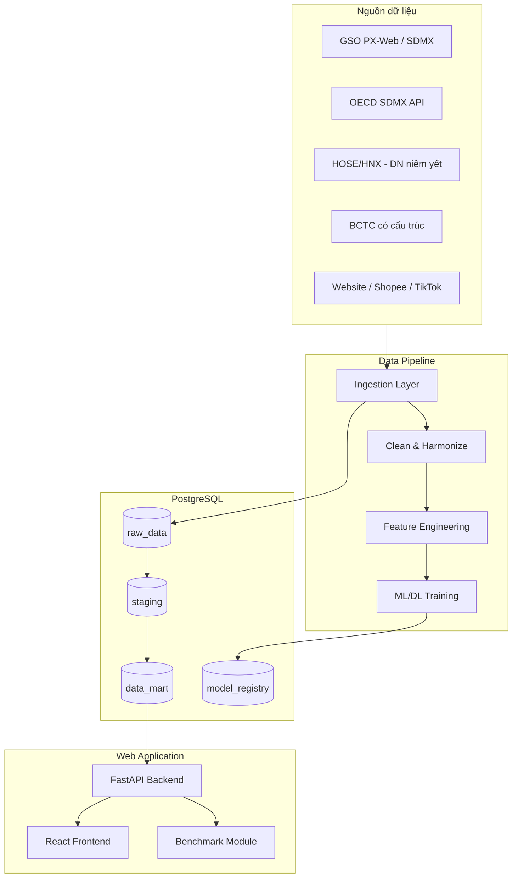
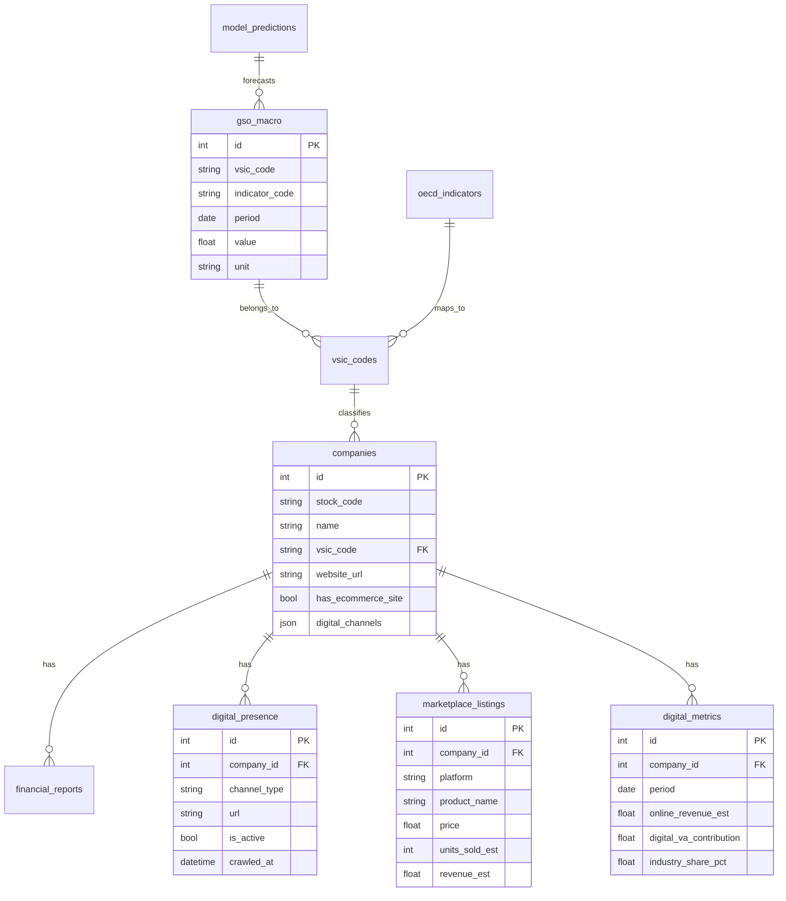

# Kế hoạch dự án: Kinh tế số ngành Chế biến, Chế tạo

## 1. Nhận xét điều chỉnh proposal hiện tại

Proposal gốc ([Proposal-DataEconomy-Lê Thanh Hà.docx](Proposal-DataEconomy-Lê Thanh Hà.docx)) có nền tảng tốt về kiến trúc pipeline 4 tầng (CRISP-DM) nhưng **chưa đủ cho yêu cầu thực tiễn** của cô:


| Vấn đề trong proposal                    | Cần điều chỉnh                                                                                                                                                                                                                        |
| ---------------------------------------- | ------------------------------------------------------------------------------------------------------------------------------------------------------------------------------------------------------------------------------------- |
| Case study **bán lẻ** (VSIC Division 47) | Chuyển sang **chế biến, chế tạo** (VSIC Section C, mã 10–33)                                                                                                                                                                          |
| Chỉ crawl macro GSO + OECD               | Thêm **micro-level**: DN niêm yết, website, sàn TMĐT                                                                                                                                                                                  |
| Biến mục tiêu = tổng mức bán lẻ          | Biến mục tiêu = **IIP, giá trị gia tăng công nghiệp, doanh thu TMĐT DN**                                                                                                                                                              |
| Không đo kênh bán số                     | Thêm **phát hiện website riêng, Shopee, TikTok Shop**                                                                                                                                                                                 |
| Visualization = Apache Superset          | **Web app full-stack** (backend API + frontend dashboard)                                                                                                                                                                             |
| Không có benchmark DN                    | Chuẩn bị module **Benchmark My Performance** (tham chiếu [SingStat BITE](https://www.singstat.gov.sg/data-tools-services/business-insights-tool-for-enterprises-bite/benchmark-my-performance/retail-trade/wearing-apparel-footwear)) |
| File CSV 81 chỉ tiêu TMĐT bán lẻ         | **Tái cấu trúc** thành bộ chỉ tiêu VDEI cho manufacturing                                                                                                                                                                             |


---

## 2. Kiến trúc hệ thống tổng thể




**Tech stack đề xuất** (kế thừa proposal, bổ sung web app):

- **Crawl**: Playwright (GSO PX-Web), `requests` + `pandasdmx` (OECD), BeautifulSoup
- **Pipeline orchestration**: Prefect hoặc Apache Airflow (nhẹ hơn Spark cho quy mô ~10 DN)
- **DB**: PostgreSQL 16
- **Backend**: FastAPI + SQLAlchemy + Alembic migrations
- **Frontend**: React + Vite + Recharts/ECharts
- **ML/DL**: scikit-learn, XGBoost/LightGBM, PyTorch (LSTM/GRU)
- **Deploy**: Docker Compose (app + db + redis + worker)

---

## 3. Mục 4 chi tiết — Cấu trúc thu thập dữ liệu

### 3.1. Ánh xạ ngành ISIC ↔ VSIC (thay Division 47 → Section C)


| Mã ISIC Rev.4  | Mã VSIC 2018           | Diễn giải                                                      |
| -------------- | ---------------------- | -------------------------------------------------------------- |
| Section C      | Ngành cấp 1 - Mã C     | Công nghiệp chế biến, chế tạo                                  |
| Division 10–33 | Ngành cấp 2 - Mã 10–33 | Các nhóm ngành chế biến chế tạo                                |
| Class 4-digit  | Mã 4 chữ số            | Chi tiết (vd: 2740 = sản xuất thiết bị chiếu sáng → Rạng Đông) |


### 3.2. Ba luồng thu thập song song

#### Luồng A — Macro ngành (GSO, tự động)


| Dataset                           | Chỉ tiêu                           | Tần suất (nguồn) | Phương pháp / trạng thái Phase 1 |
| --------------------------------- | ---------------------------------- | ---------------- | -------------------------------- |
| IIP (Chỉ số sản xuất công nghiệp) | IIP Section C (`AIP_ISIC4_C_IX`)   | Tháng            | **Đã làm** — SDMX `nsdp.nso.gov.vn/.../IIPVNM.xml` |
| Chỉ số tiêu thụ CN CBCT           | Shipment / WHOLE MANUFACTURING     | **Năm** (NSO)    | **Đã làm** — PX-Web `E07.03.px`; step-hold → tháng khi ingest |
| Chỉ số tồn kho CN CBCT            | Inventory as of 31/12              | **Năm** (NSO)    | **Đã làm** — PX-Web `E07.04.px`; step-hold → tháng khi ingest |
| GRDP/GDP theo ngành               | Giá trị gia tăng công nghiệp       | Quý/Năm          | Chưa (Phase sau) |
| Số DN, lao động, doanh thu ngành  | Thống kê doanh nghiệp công nghiệp  | Năm              | Chưa (Phase sau) |


**GSO/NSO PX-Web & SDMX đã xác nhận (2026-07-18):**

- SDMX IIP: `https://nsdp.nso.gov.vn/GSO-chung/SDMXFiles/GSO/IIPVNM.xml` (host cũ `nsdp.gso.gov.vn` chết)
- PX-Web API: `https://pxweb.nso.gov.vn/api/v1/en/Industry/`
  - `E07.03.px` — shipment / chỉ số tiêu thụ CBCT
  - `E07.04.px` — inventory / chỉ số tồn kho 31/12
- Host cũ `*.gso.gov.vn` (industry pages, px-web) → **404 / timeout**; dùng `*.nso.gov.vn`
#### Luồng B — Micro doanh nghiệp niêm yết (~10 DN mẫu)

**Danh sách DN mẫu đề xuất** (đại diện đa ngành con):


| Mã CK | Tên                   | VSIC                       | Lý do chọn            |
| ----- | --------------------- | -------------------------- | --------------------- |
| RAL   | Rạng Đông             | 2740 (thiết bị chiếu sáng) | Ví dụ cô nêu, có TMĐT |
| HPG   | Hòa Phát              | 2410 (sắt thép)            | DN lớn, có website    |
| VNM   | Vinamilk              | 1050 (sữa)                 | Bán online mạnh       |
| FPT   | FPT (electronics mfg) | 2620                       | Chuyển đổi số cao     |
| GVR   | Cao su Việt Nam       | 2211                       | Ngành truyền thống    |
| DGC   | Đức Giang Chemicals   | 2011                       | Hóa chất              |
| MSN   | Masan                 | 1071 (thực phẩm)           | Đa kênh bán           |
| PNJ   | PNJ                   | 3211 (trang sức)           | Bán lẻ + TMĐT         |
| REE   | REE Electric          | 2710                       | Thiết bị điện         |
| BWE   | Bình Minh Plastics    | 2220                       | Nhựa                  |


**Dữ liệu crawl từng DN:**


| Nhóm                    | Trường dữ liệu                                  | Nguồn                         | Tự động?                  |
| ----------------------- | ----------------------------------------------- | ----------------------------- | ------------------------- |
| Thông tin cơ bản        | Tên, mã CK, VSIC, website chính thức            | HOSE/HNX API, Vietstock       | Có                        |
| BCTC có cấu trúc        | Doanh thu, LNST, tài sản, vốn CSH, chi phí      | BCTC niêm yết (PDF/XBRL)      | Bán tự động (PDF extract) |
| Hiện diện số            | Có website bán hàng? URL, có giỏ hàng/checkout? | HTTP crawl + rule-based       | Có                        |
| Sàn TMĐT                | Có shop Shopee/TikTok/Lazada? URL shop          | Search API + scrape shop page | Có (ML hỗ trợ match)      |
| Ước lượng bán online    | Số lượng đã bán, rating, giá TB                 | Scrape listing sản phẩm       | Có (ước lượng)            |
| Doanh thu TMĐT (nếu có) | Tỷ trọng online trong BCTC/AR                   | BCTC thường niên              | Bán tự động               |


#### Luồng C — Quốc tế (OECD, tự động)


| Dataset OECD                      | Vai trò                | Mapping / trạng thái Phase 1 |
| --------------------------------- | ---------------------- | ---------------------------- |
| MEI — Industrial Production Index | Leading indicator      | **Không có cho VNM**; dùng peer **EA20** (`source=OECD_PEER`) cho forecast lags |
| INDIGO (Digital trade openness)   | Leading indicator      | **Đã làm** — series năm VNM; step-hold → tháng |
| ICT Investment by industry        | Digital adoption proxy | Unavailable cho VNM (không bịa) |
| Business Confidence Index         | Leading indicator      | Unavailable cho VNM (không bịa) |


**Đồng bộ tần suất**: quý→tháng (linear); năm→tháng (**step-hold**, không nội suy tuyến tính). Chi tiết: `docs/adr/0001-oecd-vietnam-macro-policy.md`.
### 3.3. Bộ chỉ tiêu VDEI cho Manufacturing (tái cấu trúc từ CSV)

Chuyển 10 pillar trong [File hướng dẫn crawl data - đề tài chỉ số kinh tế số - Trang tính1.csv](File hướng dẫn crawl data - đề tài chỉ số kinh tế số - Trang tính1.csv) sang ngữ cảnh chế biến chế tạo:


| Pillar | Tên mới (Manufacturing) | Chỉ tiêu cốt lõi (Tier 1)                                                |
| ------ | ----------------------- | ------------------------------------------------------------------------ |
| M1     | Quy mô & hiệu quả SXCN  | IIP Section C, giá trị gia tăng công nghiệp, tốc độ tăng GRDP ngành      |
| M2     | Chuyển đổi số DN        | % DN có website, % DN bán trên sàn, % DN dùng ERP/IoT                    |
| M3     | Doanh thu TMĐT ngành SX | Doanh thu online ước tính / tổng doanh thu ngành                         |
| M4     | Kênh bán số             | Tỷ trọng website riêng vs marketplace vs social commerce                 |
| M5     | Hiệu quả số hóa         | Doanh thu/lao động, digital revenue per worker                           |
| M6     | Đóng góp KTS            | Digital value-added = f(doanh thu TMĐT, chi phí số, productivity uplift) |
| M7     | Hạ tầng & logistics số  | % DN dùng logistics TMĐT, thời gian giao hàng                            |
| M8     | Thanh toán số B2B/B2C   | % giao dịch qua cổng thanh toán online                                   |
| M9     | Xuất khẩu số            | % đơn hàng qua kênh online quốc tế                                       |
| M10    | Năng lực cạnh tranh số  | So sánh percentile với ngành (benchmark module)                          |


**Công thức ước lượng giá trị gia tăng kinh tế số (DN level):**

```
Digital_VA_estimate = 
  (Estimated_online_revenue × Digital_margin_proxy) 
  + (Cost_savings_from_digital × Adoption_score)
  - Digital_investment_amortized

Trong đó:
- Estimated_online_revenue = Σ(unit_price × units_sold) từ scrape Shopee/TikTok
  HOẶC nội suy từ tỷ lệ TMĐT/ngành × doanh thu DN (nếu không scrape được)
- Digital_margin_proxy = lấy từ BCTC (gross margin) hoặc ngành benchmark
- Adoption_score = weighted(C01 website + C06 marketplace + C05 social)
```

### 3.4. Schema database chính




---

## 4. Pipeline xử lý & ML/DL

### 4.1. Clean data (3 kịch bản từ proposal + bổ sung)

1. **Missing values**: median (gap ngắn), linear interpolation (gap dài) — giữ từ proposal
2. **Outlier detection**: IQR/Z-score cho scrape marketplace (giá/số lượng bất thường)
3. **Entity resolution**: ML classifier (TF-IDF + cosine similarity) match tên shop Shopee ↔ tên DN niêm yết
4. **VSIC mapping**: bảng ánh xạ 1:1 ISIC Section C ↔ VSIC 10–33

### 4.2. Feature engineering


| Nhóm feature | Biến                                      | Mục đích                          |
| ------------ | ----------------------------------------- | --------------------------------- |
| Lag (macro)  | CCI_lag1q, INDIGO_lag1q, IIP_lag2m        | Truyền dẫn kinh tế quốc tế → SXCN |
| Rolling      | IIP_roll3m, IIP_roll6m                    | Xu hướng trung hạn                |
| Digital      | digital_adoption_score, channel_diversity | Mức số hóa DN                     |
| Cross        | online_revenue_ratio × IIP_growth         | Tương tác KTS-SXCN                |
| Financial    | ROA, ROE, current_ratio (từ BCTC)         | Input benchmark                   |


### 4.3. Mô hình huấn luyện (3 tầng như proposal)


| Tier        | Model            | Target variable               | Input                          |
| ----------- | ---------------- | ----------------------------- | ------------------------------ |
| Statistical | ARIMA/SARIMAX    | IIP Section C (tháng)         | IIP history + OECD lags        |
| ML          | XGBoost/LightGBM | IIP + digital_va_growth       | Tabular features               |
| DL          | LSTM/GRU         | Multi-step forecast 3–6 tháng | Sequence IIP + digital metrics |


**Đánh giá**: MAE, RMSE, MAPE — walk-forward validation (train 2018–2023, test 2024–2025).

**ML bổ sung cho crawl**:

- **Shop matcher**: Binary classifier xác nhận shop Shopee/TikTok thuộc DN (precision > 90%)
- **Product categorizer**: Phân loại sản phẩm theo VSIC 4-digit từ tên SP
- **Trend detector**: Time series anomaly detection (Isolation Forest / LSTM autoencoder) trên IIP

---

## 5. Web application — các module

### Module 1: Dashboard tổng quan ngành

- Biểu đồ IIP, giá trị gia tăng, xu hướng dự báo
- Heatmap đóng góp KTS theo nhóm ngành VSIC
- So sánh OECD leading indicators vs GSO lagging

### Module 2: Doanh nghiệp (~10 DN mẫu)

- Profile từng DN: kênh bán số (website/Shopee/TikTok), ước lượng doanh thu online
- Ví dụ **Rạng Đông**: website `rangdong.com.vn`, shop Shopee, đóng góp vào ngành 2740
- Timeline crawl history + data quality score

### Module 3: Pipeline monitor

- Trạng thái job crawl (GSO, marketplace, OECD)
- Log lỗi, lần crawl cuối, số record mới

### Module 4: ML Lab

- So sánh 3 model (ARIMA vs XGBoost vs LSTM)
- Biểu đồ forecast vs actual
- Feature importance

### Module 5: Benchmark (Phase 2 — tham chiếu SingStat BITE)

- Form nhập: Doanh thu, LN trước thuế, số NV, chi phí (hàng hóa, thuê, lương)
- Output: ROA, ROE, Current Ratio, Equity Ratio + **percentile so với ngành**
- Nội suy từ BCTC công ty chưa đủ field → dùng tỷ lệ ngành từ GSO

---

## 6. Lộ trình triển khai (~18 tuần / 1 học kỳ)

### Tiến độ thực tế (cập nhật 2026-07-18)

| Giai đoạn | Trạng thái | Ghi chú |
| --------- | ---------- | ------- |
| **1 — Nền tảng & Macro** | **Hoàn thành** | Branch `cursor/phase1-macro-crawlers`, commit `62a9054` (local; **chưa push**) |
| 2 — Enterprise crawl & Digital | Chưa bắt đầu | Seed 10 DN có sẵn; crawler micro còn stub/scaffold |
| 3 — Clean, Features & ML | Một phần scaffold | Feature eng đã join GSO IIP + INDIGO + MEI_IP@EA20; ML chưa train thật |
| 4 — Web hoàn thiện | Scaffold | React shell / API skeleton có; dashboard chưa hoàn thiện |
| 5 — Benchmark & Báo cáo | Chưa | |

**Git:** đã tạo branch + commit Phase 1 trên máy local. **Chưa** `git push` lên remote (không có upstream).

### Giai đoạn 1: Nền tảng & Macro data (Tuần 1–5) — DONE

Checklist nghiệm thu (đã kiểm chứng bằng code + live HTTP + pytest):

- [x] Scaffold: Docker Compose (Postgres 16 + Redis), FastAPI, React/Vite shell
- [x] VSIC/ISIC Section C: level-1 `C`, divisions **10–33**, class 4-digit cho 10 DN
- [x] Seed 10 DN cố định: RAL, HPG, VNM, FPT, GVR, DGC, MSN, PNJ, REE, BWE (idempotent; schema từ Alembic)
- [x] Alembic: `48406b8f82a5` initial schema + `b7c2e1a94d10` cột `oecd_indicators.source`
- [x] GSO/NSO crawler:
  - IIP_C tháng từ SDMX `nsdp.nso.gov.vn`
  - SHIPMENT_C + INVENTORY_C từ PX-Web `E07.03` / `E07.04` (năm → step-hold tháng)
  - Fallback sourced dưới `data/raw/` (không random)
- [x] OECD SDMX (`sdmx.oecd.org`): INDIGO@VNM; MEI_IP@EA20 peer; MEI/BCI/ICT@VNM = unavailable rõ ràng
- [x] Tests crawler: `tests/gso` + `tests/oecd` (33 passed tại thời điểm đóng Phase 1)
- [x] Domain docs: `AGENTS.md`, `CONTEXT.md`, ADR-0001

### Giai đoạn 2: Enterprise crawl & Digital detection (Tuần 6–10)

- Crawl danh sách 10 DN niêm yết + metadata
- Website detector (có checkout/giỏ hàng?)
- Shopee/TikTok shop finder + product scraper
- BCTC PDF extractor (doanh thu, chi phí cấu trúc)
- Shop-matcher ML model
- Tính digital metrics per company

### Giai đoạn 3: Clean, Features & ML (Tuần 11–14)

- Data cleaning pipeline (Prefect/Airflow DAGs)
- Feature engineering
- Train & evaluate ARIMA, XGBoost, LSTM
- Model registry + API endpoints

### Giai đoạn 4: Web hoàn thiện & Demo (Tuần 15–17)

- Dashboard modules 1–4
- Company detail pages (Rạng Đông case study)
- Pipeline monitor UI
- Integration testing end-to-end

### Giai đoạn 5: Benchmark & Báo cáo (Tuần 18)

- Benchmark module (SingStat BITE style)
- Cập nhật proposal Mục 4 với kết quả thực tế
- Demo presentation + documentation

---

## 7. Cấu trúc thư mục dự án đề xuất

```
ai-in-data-economy/
├── docker-compose.yml
├── backend/
│   ├── app/
│   │   ├── api/          # FastAPI routes
│   │   ├── models/       # SQLAlchemy models
│   │   ├── schemas/      # Pydantic schemas
│   │   └── services/     # Business logic
│   └── alembic/          # DB migrations
├── crawlers/
│   ├── gso/              # PX-Web + SDMX
│   ├── oecd/             # SDMX API
│   ├── marketplace/      # Shopee, TikTok
│   ├── companies/        # Stock exchange, websites
│   └── financial/        # BCTC parser
├── pipeline/
│   ├── cleaning/
│   ├── features/
│   └── dags/             # Prefect/Airflow flows
├── ml/
│   ├── models/           # ARIMA, XGBoost, LSTM
│   ├── shop_matcher/
│   └── evaluation/
├── frontend/
│   └── src/
│       ├── pages/        # Dashboard, Company, ML, Benchmark
│       └── components/
├── data/
│   ├── mappings/         # VSIC-ISIC table
│   └── seeds/            # 10 sample companies
└── docs/
    └── proposal-v2.md    # Proposal cập nhật Mục 4
```

---

## 8. Rủi ro & giảm thiểu


| Rủi ro                                   | Giảm thiểu                                                |
| ---------------------------------------- | --------------------------------------------------------- |
| Host GSO đổi sang NSO / URL chết         | Ưu tiên `*.nso.gov.vn`; SDMX + PX-Web API; fallback sourced có provenance |
| PX-Web shipment/inventory chỉ có **năm** | Step-hold năm→tháng khi ingest; ghi rõ trong ADR / CONTEXT |
| OECD thiếu MEI/BCI/ICT cho VNM           | Không bịa; dùng INDIGO@VNM + MEI_IP@EA20 peer cho forecast |
| Shopee/TikTok chặn scrape                | Rate limiting, rotate UA; dùng official search API nếu có |
| Shop không match đúng DN                 | ML matcher + manual QA cho 10 DN mẫu                      |
| BCTC PDF khó parse                       | Ưu tiên DN có BCTC HTML/XBRL; nội suy cho field thiếu     |
| Không có doanh thu TMĐT riêng trong BCTC | Ước lượng từ scrape marketplace + tỷ lệ ngành             |


---

## 9. Kết quả deliverable cuối học kỳ

1. **Web app chạy được** với 4 module chính (Dashboard, DN, Pipeline, ML Lab)
2. **Database** chứa macro GSO/OECD + micro 10 DN + digital presence
3. **Pipeline tự động** crawl định kỳ (cron/Prefect schedule)
4. **3 model** đã train, so sánh metric, API forecast
5. **Case study Rạng Đông** đầy đủ: kênh bán, ước lượng online, đóng góp ngành
6. **Proposal v2** — Mục 4 cập nhật với schema, chỉ tiêu, công thức thực tế
7. **Benchmark module** (prototype) nhập liệu → so sánh percentile ngành

